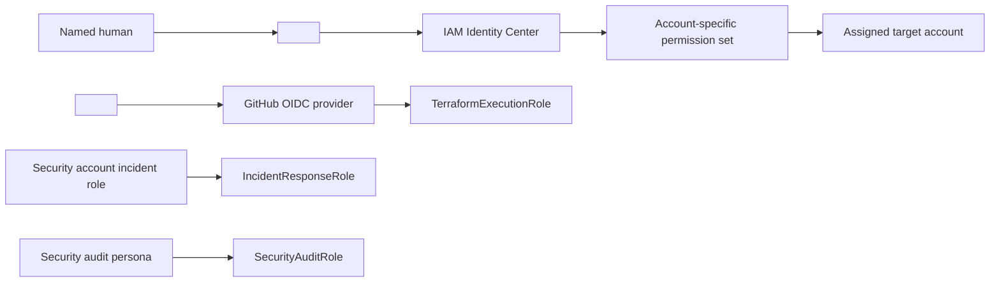

# Account and Organizational Unit Structure

## Status

**Status:** initial design; identifiers and contacts unresolved.

This document applies the stricter OU decision from [decisions-and-prerequisites.md](decisions-and-prerequisites.md). It must not contain real root credentials, recovery answers, account emails, or secrets. Store sensitive account-registry data in an approved access-controlled system.

## Typed placeholder registry

| Placeholder | Required value |
|---|---|
| `<ORG_ID:organization>` | AWS Organizations organization ID |
| `<ROOT_ID:organization>` | Organizations root ID |
| `<OU_ID:security>` | Security OU ID |
| `<OU_ID:infrastructure>` | Infrastructure OU ID |
| `<OU_ID:non_production>` | Non-Production OU ID |
| `<OU_ID:production>` | Production OU ID |
| `<OU_ID:sandbox>` | Sandbox OU ID |
| `<ACCOUNT_ID:name>` | Twelve-digit account ID for the named account |
| `<EMAIL:name>` | Unique, monitored account email stored outside Git |
| `<OWNER:name>` | Named accountable owner, not only a team alias |
| `<COST_CENTER:name>` | Approved billing allocation value |

## OU and account diagram

```text
Organization <ORG_ID:organization>
└── Root <ROOT_ID:organization>
    ├── Security <OU_ID:security>
    │   ├── Security / Audit <ACCOUNT_ID:security>
    │   └── Log Archive <ACCOUNT_ID:log_archive>
    ├── Infrastructure <OU_ID:infrastructure>
    │   ├── Shared Services <ACCOUNT_ID:shared_services>
    │   └── AFT Management <ACCOUNT_ID:aft> [not created; deferred]
    ├── Non-Production <OU_ID:non_production>
    │   ├── Development <ACCOUNT_ID:development>
    │   └── Staging <ACCOUNT_ID:staging>
    ├── Production <OU_ID:production>
    │   └── Production <ACCOUNT_ID:production>
    └── Sandbox <OU_ID:sandbox>
        └── Sandbox <ACCOUNT_ID:sandbox> [optional]
```

The management account `<ACCOUNT_ID:management>` owns the organization but is not placed in a child OU.

## Sanitized account registry

| Account | Account ID | OU | Owner | Cost center | Lifecycle | Purpose |
|---|---|---|---|---|---|---|
| Management | `<ACCOUNT_ID:management>` | Root | `<OWNER:management>` | `<COST_CENTER:management>` | REQUIRED | Control Tower, Organizations, billing, account vending, and organization integrations only |
| Security/Audit | `<ACCOUNT_ID:security>` | Security | `<OWNER:security>` | `<COST_CENTER:security>` | REQUIRED | Delegated security administration, investigation, automation, and audit access |
| Log Archive | `<ACCOUNT_ID:log_archive>` | Security | `<OWNER:log_archive>` | `<COST_CENTER:log_archive>` | REQUIRED | Protected central audit and approved network-log storage |
| Shared Services | `<ACCOUNT_ID:shared_services>` | Infrastructure | `<OWNER:shared_services>` | `<COST_CENTER:shared_services>` | REQUIRED | Network hub, DNS, CI/CD, artifacts, and shared operations when approved |
| Development | `<ACCOUNT_ID:development>` | Non-Production | `<OWNER:development>` | `<COST_CENTER:development>` | REQUIRED | Development and module testing without production data |
| Staging | `<ACCOUNT_ID:staging>` | Non-Production | `<OWNER:staging>` | `<COST_CENTER:staging>` | REQUIRED | Production-like release, integration, performance, and security validation |
| Production | `<ACCOUNT_ID:production>` | Production | `<OWNER:production>` | `<COST_CENTER:production>` | REQUIRED | Live workloads with strict access and change controls |
| Sandbox | `<ACCOUNT_ID:sandbox>` | Sandbox | `<OWNER:sandbox>` | `<COST_CENTER:sandbox>` | Optional | Short-lived experimentation under budget and expiry controls |
| AFT Management | `<ACCOUNT_ID:aft>` | Infrastructure | `<OWNER:aft>` | `<COST_CENTER:aft>` | Deferred | AFT pipeline only if GitOps account vending is approved later |

## Responsibility boundaries

### Management account

- Restrict routine access to organization administrators through federation.
- Do not run application, shared-service, security-analysis, or CI worker workloads.
- Retain root credentials only for documented account-recovery actions with strong MFA and monitored custody.
- Perform Control Tower updates, account vending, organization policy administration, and delegated-admin registration through approved changes.

### Security and Log Archive accounts

- Security operators administer finding aggregation and incident-response tooling but do not administer workload applications.
- Log Archive administrators are separate from workload administrators; audit read access is distinct from delete/retention administration.
- Neither account hosts general workloads.
- KMS recovery, S3 policy recovery, and log-delivery monitoring require named owners.

### Shared Services account

- Hosts only services with a documented multi-account consumer model.
- A shared service does not imply unrestricted network reachability.
- Network, DNS, CI/CD, artifact, and observability privileges remain distinct.
- Production trust and routes are explicitly approved rather than inherited from non-production.

### Workload accounts

- Development is the first deployment and control-test target.
- Staging mirrors production where practical but uses separate data, credentials, state, and network paths.
- Production requires protected CI/CD approval and documented break-glass handling.
- Workload teams cannot disable central audit/security baselines or administer organization policies.

## Identity Center and permission model

The identity source is `<IDENTITY_SOURCE:primary>` and the IAM Identity Center Region is `<REGION:identity_center>`; both are REQUIRED before Control Tower setup.

| Persona | Proposed permission set or role | Primary scope | Key restriction |
|---|---|---|---|
| Organization administrator | `OrganizationAdmin` / `OrganizationAdminRole` | Management control plane | Small named group; no workload administration by default |
| Platform engineer | `PlatformAdmin` | Approved non-production/platform accounts | Production access requires separate assignment |
| Security auditor | `SecurityAudit` / `SecurityAuditRole` | All governed accounts, read-only security evidence | Cannot modify workloads or log retention |
| Network administrator | `NetworkAdmin` / `NetworkAdminRole` | Shared Services and approved network resources | No application or organization-policy administration |
| Read-only operator | `ReadOnly` / `ReadOnlyRole` | Assigned accounts | No write permissions or role delegation |
| Incident responder | `IncidentResponse` / `IncidentResponseRole` | Security and affected accounts | Time-bounded activation, case reference, monitored actions |
| Terraform CI | `TerraformExecutionRole` | One target account/environment per trust policy | OIDC only, scoped repository/ref/environment, no access keys |
| Emergency administrator | `BreakGlassAdminRole` | One target account | Explicit activation, strong MFA, immediate alerts, retrospective review |

Permission sets grant human sessions. IAM roles support workload/CI and carefully defined cross-account functions. SCPs do not grant access.

## Cross-account trust model



Trust policies must name exact organization/repository/branch/environment conditions or exact trusted principals. Wildcard principals and long-lived CI keys are prohibited. Role chaining is avoided unless a reviewed central deployment-role model is explicitly selected.

## Break-glass and root recovery

1. Maintain a `BreakGlassAdminRole` in each required account only after its activation path and alerting exist.
2. Require a named incident/change reference, two-person authorization where operationally possible, strong MFA, short session duration, and immediate Security account notification.
3. Deny routine assignment. Test access without performing destructive actions at an approved interval `<INTERVAL:break_glass_test>`.
4. Record CloudTrail evidence and review every use within `<SLA:break_glass_review>`.
5. Treat root access separately: secure hardware MFA, monitored mailbox/phone, alternate contacts, and a documented custody/recovery process.

## Account vending and lifecycle

Initial accounts use Control Tower Account Factory after Gates A through C. AFT remains deferred.

```text
Approved registry entry
→ unique monitored email and owner
→ Account Factory request
→ target OU placement
→ Control Tower enrollment/baseline
→ Identity Center assignment
→ Terraform custom baseline
→ validation evidence
→ operational handover
```

Suspension or closure requires log/evidence preservation, workload/data disposition, role removal, budget review, DNS/network detachment, and Control Tower/Organizations lifecycle procedures. Account IDs are never reused as informal environment labels.

## Failure, recovery, and cost considerations

- Compromise of one workload account is contained by account boundaries, but central trust policies and shared networking can expand blast radius if too broad.
- Loss of Identity Center or IdP access requires tested emergency access; it must not lead to routine IAM-user creation.
- Security account failure reduces centralized visibility; Log Archive failure risks evidence delivery/access. Both require alarms and recovery ownership.
- Every account and enabled Region increases baseline Config, security, logging, KMS, and operational costs.
- Sandbox accounts require budgets, expiry, restricted services, and automated cleanup to avoid cost leakage.
- AFT adds a dedicated account and pipeline services, so it remains deferred until account-vending volume justifies it.

## Assumptions and unresolved decisions

- REQUIRED: all account IDs, emails, named owners, cost centers, recovery contacts, and account quotas.
- REQUIRED: existing Organization/Control Tower status and actual OU/root IDs.
- REQUIRED: identity source, Identity Center Region, permission-set assignments, session durations, and access-review interval.
- REQUIRED: break-glass custodians, activation channel, MFA standard, test interval, alert destination, and review SLA.
- REQUIRED: whether a Sandbox account is initially created.
- Assumption: Account Factory is sufficient for the initial fixed account set; AFT is not deployed.
- Assumption: management, security, and logging accounts contain no general workloads.
