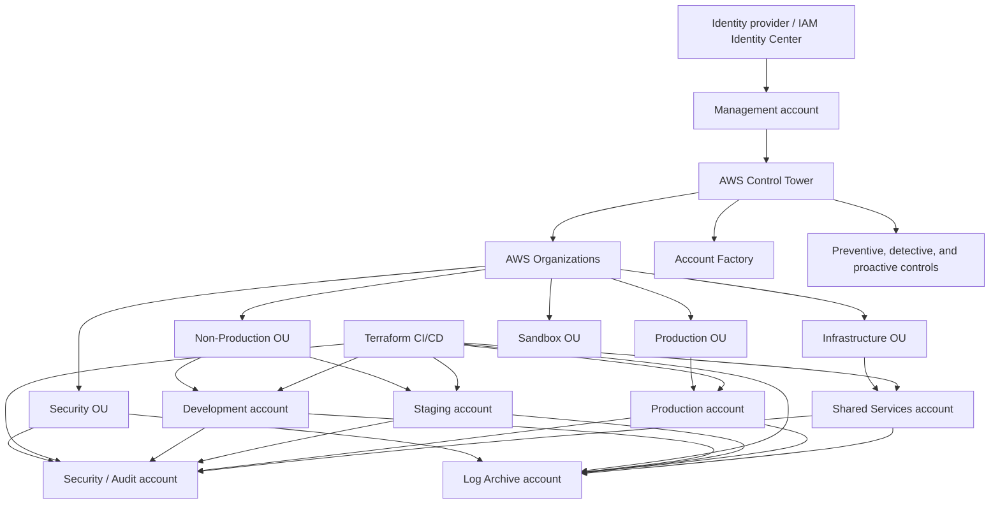
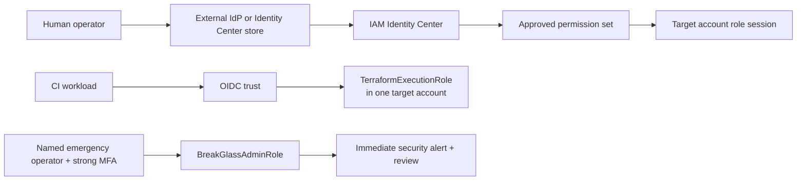
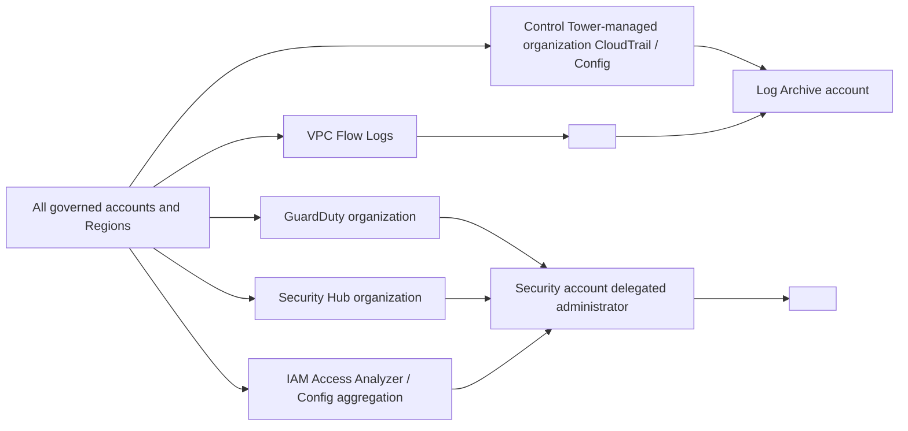

# Landing Zone Architecture

## Status and authority

**Status:** initial design; not deployment authorization.

The source of truth for approved, proposed, and unresolved values is [decisions-and-prerequisites.md](decisions-and-prerequisites.md). This design assumes AWS Control Tower first, Account Factory for the initial fixed account set, Terraform for extensions, and no AFT during the initial implementation.

Typed placeholders use `<TYPE:name>`, for example `<ACCOUNT_ID:security>` or `<REGION:home>`. They must be resolved through the approval gates before use.

## Design goals

- Isolate management, security, logging, shared infrastructure, and workload environments by account.
- Use Control Tower as the landing-zone lifecycle owner rather than recreating its baseline in Terraform.
- Centralize audit evidence and security findings outside workload administrator control.
- Provide federated, temporary, least-privilege access with explicit emergency paths.
- Promote reusable changes through development, staging, and production without sharing state.
- Keep production network paths, credentials, approvals, and failure domains separate from non-production.

## Logical architecture



Arrows to Log Archive represent audit and network-log delivery. Arrows to Security represent delegated-administrator aggregation, not general network trust.

## Control plane and ownership boundary

| Layer | Owner | Included resources | Boundary |
|---|---|---|---|
| Landing-zone control plane | AWS Control Tower | Landing zone, mandatory controls, governed-OU/account baselines, managed StackSets, Control Tower roles, Audit/Log Archive baseline, managed CloudTrail/Config where configured | Never import or modify with Terraform without a separately approved ownership transfer |
| Organization control plane | Control Tower plus approved Organizations administration | Organization, OUs, account placement, delegated services | Terraform may manage only documented extensions that do not conflict with Control Tower |
| Identity plane | IAM Identity Center/external IdP plus IAM | Permission sets, federated access, target-account roles, emergency access | Human users use federation; CI uses OIDC; no committed credentials |
| Security and evidence plane | Security and Log Archive accounts | Finding aggregation, incident response, organization logs, retention, audit access | Workload administrators cannot administer central evidence or security aggregation |
| Platform extension plane | Terraform | Custom IAM, approved SCPs, VPCs, TGW/DNS if approved, security extensions, workload baselines, CI/CD roles | Every state has one owner, target account, and explicit Control Tower overlap review |
| Workload plane | Environment account teams | Application resources within platform guardrails | Production changes require protected CI approval; no management-account workloads |

Detailed ownership rules are in [control-tower-landing-zone.md](control-tower-landing-zone.md) and [terraform-workflow.md](terraform-workflow.md).

## Account and OU topology

The selected topology is the stricter OU model because production requires a distinct policy and approval boundary:

```text
Root <ROOT_ID:organization>
├── Security <OU_ID:security>
│   ├── Security / Audit <ACCOUNT_ID:security>
│   └── Log Archive <ACCOUNT_ID:log_archive>
├── Infrastructure <OU_ID:infrastructure>
│   ├── Shared Services <ACCOUNT_ID:shared_services>
│   └── AFT Management <ACCOUNT_ID:aft> [deferred]
├── Non-Production <OU_ID:non_production>
│   ├── Development <ACCOUNT_ID:development>
│   └── Staging <ACCOUNT_ID:staging>
├── Production <OU_ID:production>
│   └── Production <ACCOUNT_ID:production>
└── Sandbox <OU_ID:sandbox>
    └── <ACCOUNT_ID:sandbox> [optional]
```

See [account-structure.md](account-structure.md) for responsibilities and access boundaries.

## Identity and access flow



- Routine human access is federated and temporary.
- CI obtains temporary credentials through OIDC and an environment-specific execution role.
- Security audit, network administration, read-only, incident-response, and platform administration are separate personas.
- Break-glass access is time-bounded, monitored, tested, and reviewed after every use. Root credentials remain a distinct account-recovery mechanism, not a routine break-glass role.

## Central logging and security aggregation



The actual Flow Log destination, log bucket, retention, encryption keys, alert destination, standards, and protection plans remain unresolved. Terraform must not create a duplicate organization trail or duplicate Config recorders in Control Tower-governed accounts.

## Change promotion

```mermaid
flowchart LR
    PR["Pull request"] --> Static["fmt / validate / TFLint / Checkov / tests"]
    Static --> DevPlan["Development plan + approval"]
    DevPlan --> DevApply["Development apply"]
    DevApply --> DevEvidence["Functional and control evidence"]
    DevEvidence --> StagePlan["Staging plan + approval"]
    StagePlan --> StageApply["Staging apply"]
    StageApply --> StageEvidence["Release, security, and recovery evidence"]
    StageEvidence --> ProdPlan["Production plan + explicit approval"]
    ProdPlan --> ProdApply["Protected production apply"]
    ProdApply --> Post["Post-deployment validation and drift check"]
```



Promotion moves reviewed code and immutable artifacts; it never copies Terraform state between environments. Each environment is planned against its own state and variables.

## Failure domains and recovery

| Failure domain | Containment | Recovery consideration |
|---|---|---|
| Management account or Control Tower administration | No workloads in management; small administrator group | Preserve root recovery, alternate contacts, runbooks, and Control Tower lifecycle evidence |
| Security account | Workloads continue; central detection/response may degrade | Restore delegated administration, alerting, and aggregator configuration from reviewed code |
| Log Archive account | Workloads continue; audit delivery/access may degrade | Protect KMS keys and bucket policies; use S3 versioning and approved retention; alarm on delivery failures |
| One workload account | Account boundary limits blast radius | Rebuild custom baselines from Terraform and recover application data through workload-specific backup plans |
| One AWS Region | Governed Regions do not imply application DR | Define workload RTO/RPO and multi-Region architecture separately; Control Tower home Region remains fixed |
| Terraform state | State loss or concurrency can block safe changes | Versioned encrypted S3 backend, S3 lockfile, least privilege, tested state recovery, and no shared environment state |
| CI/CD platform | Applies stop; running workloads continue | Preserve reviewed code and lock files; use controlled emergency procedure rather than local production apply |
| Network hub/TGW if adopted | Shared connectivity can become a large blast radius | Separate route tables, staged changes, route evidence, and a documented rollback for every attachment/route change |

## Cost and complexity trade-offs

- Control Tower has no additional service charge, but Config, CloudTrail, logs, KMS, and enabled controls create usage charges.
- GuardDuty and Security Hub scale with accounts, Regions, data sources, checks, and findings.
- Per-AZ NAT Gateways improve availability but add hourly and processing costs; centralized egress can reduce duplication but increases shared blast radius and TGW/inspection charges.
- Transit Gateway simplifies scalable connectivity but adds attachment and data-processing charges; isolated VPCs are cheaper when connectivity is unnecessary.
- Longer log retention and replication improve audit recovery but create durable S3/KMS/request costs.
- AFT is deferred because its dedicated account and pipeline component services are not justified by the initial fixed account set.

## Assumptions and unresolved decisions

Assumptions:

- Commercial AWS partition is intended but not confirmed.
- The initial account set is fixed and can be provisioned through Account Factory.
- GitHub Actions is the likely CI platform, but OIDC trust is not approved.
- Proposed `eu-west-1` home and `eu-west-2` additional governed Region are design placeholders only.

Unresolved before implementation:

- All account IDs, emails, owners, OU/root IDs, identity source, and administrator groups.
- Existing Organization, Control Tower, IAM Identity Center, Config, CloudTrail, and SCP state.
- Home/governed Regions, compliance scope, log retention, alerting, and support plan.
- State account/bucket/KMS identifiers, CIDR validation, NAT model, TGW/egress/DNS scope, and security-service options.
- Named approvers and evidence owners for Gates A through E.

The complete blocking checklist remains in [decisions-and-prerequisites.md](decisions-and-prerequisites.md#11-unresolved-input-checklist).
