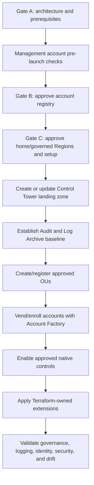

# AWS Control Tower Landing Zone Design

## Status and scope

**Status:** initial design; setup is blocked by unresolved Gate A–C inputs.

AWS Control Tower is the landing-zone lifecycle owner. Terraform extends the baseline and must not recreate or import Control Tower-owned resources. AFT is deferred. See [decisions-and-prerequisites.md](decisions-and-prerequisites.md) for the binding decisions and current official references.

## Target settings

| Setting | Design value | Status |
|---|---|---|
| AWS partition | `<AWS_PARTITION:commercial_or_other>` | REQUIRED |
| Organization | `<ORG_ID:organization>` | REQUIRED: existing or new |
| Management account | `<ACCOUNT_ID:management>` | REQUIRED |
| Home Region | `<REGION:home>`; `eu-west-1` proposed | REQUIRED approval; cannot be changed after creation |
| Additional governed Regions | `<REGION_SET:governed>`; `eu-west-2` proposed | REQUIRED approval |
| Identity Center Region | `<REGION:identity_center>` | REQUIRED; must satisfy Control Tower prerequisites |
| Identity source | `<IDENTITY_SOURCE:primary>` | REQUIRED |
| Audit account | `<ACCOUNT_ID:security>` / `<EMAIL:security>` | REQUIRED; email stored outside Git |
| Log Archive account | `<ACCOUNT_ID:log_archive>` / `<EMAIL:log_archive>` | REQUIRED; email stored outside Git |
| Initial account vending | Account Factory | Selected |
| AFT | Deferred | Reassess only for GitOps account-vending demand |

## Landing-zone sequence



No step after an approval gate is implied by completion of this document.

## Prerequisite review

Before landing-zone setup:

- Confirm whether an Organization or landing zone already exists and inventory accounts, OUs, policies, trusted access, delegated administrators, StackSets, Config, and CloudTrail.
- Confirm quota capacity for required accounts and obtain unique monitored Audit/Log Archive emails.
- Verify management-account root MFA, alternate contacts, billing ownership, support plan, and emergency recovery.
- Resolve IAM Identity Center Region/source compatibility and activate STS endpoints in every governed Region.
- Identify existing Config recorders/delivery channels/aggregators and CloudTrail trails that could block enrollment or cause duplicate cost.
- Approve data residency, the home Region, governed Regions, and a Region-deny/exception approach.
- Produce a cost estimate for underlying Config, CloudTrail, logging, KMS, security services, and account/Region count.

## Control Tower-owned lifecycle

Control Tower owns or governs:

- Landing-zone configuration and updates.
- Mandatory controls and all controls enabled through the Control Tower control catalog.
- Control Tower service-linked/execution roles and managed StackSets/baselines.
- Governed OU registration, account enrollment/update status, and baseline drift handling.
- Audit and Log Archive baseline resources.
- Organization CloudTrail and Config resources created/configured by the landing zone.
- Account Factory products and account-enrollment lifecycle.
- Identity Center groups or assignments created by its supported workflow.

Terraform may read identifiers through data sources or approved outputs but must not adopt lifecycle ownership merely because a resource is discoverable.

## Terraform extension boundary

After Control Tower is healthy, Terraform may manage:

- Custom cross-account and CI execution roles.
- Permission boundaries and account-level safeguards not owned by Control Tower.
- Custom SCPs only after native-control mapping and Gate D.
- Delegated security-service extensions where they do not duplicate a baseline.
- Workload/shared-service VPCs, optional TGW, private DNS, endpoints, and Flow Logs.
- Alerting, budgets, validation automation, and workload account baselines.

Every module README must name the deployment account, Regions, state, owner, Control Tower overlap, and recovery procedure.

## OU governance and account enrollment

Selected governed OUs:

- Security `<OU_ID:security>`
- Infrastructure `<OU_ID:infrastructure>`
- Non-Production `<OU_ID:non_production>`
- Production `<OU_ID:production>`
- Sandbox `<OU_ID:sandbox>` when approved

Account placement is defined in [account-structure.md](account-structure.md). Register and validate one lower-risk OU before broader rollout where the Control Tower setup path permits it. Existing accounts must satisfy enrollment prerequisites; do not force enrollment by deleting resources without a reviewed migration plan.

## Region governance

The provisional home Region is `eu-west-1`, and the provisional additional governed Region is `eu-west-2`. Both remain typed decisions `<REGION:home>` and `<REGION_SET:governed>` until approved.

- Home Region selection is irreversible for the landing zone.
- Adding/removing governed Regions is a landing-zone update and requires OU/account updates or re-registration.
- A Region not governed by Control Tower is not automatically blocked for deployment.
- Preventive controls have different Region behavior from detective/proactive controls; validate current control behavior before enablement.
- A separate Region-deny control/SCP and exception list is required if deployments outside approved Regions must be blocked.

## Controls strategy

1. Inventory mandatory controls.
2. Map each project requirement to a current native preventive, detective, or proactive control.
3. Enable native controls at the narrowest appropriate OU.
4. Record control identifiers as `<CONTROL_ID:requirement>` only after catalog verification.
5. Use custom SCPs only for a documented gap or stricter organization rule.
6. Test in Sandbox or Development, then promote to Staging and Production under Gate D.

The responsibility matrix is maintained in [guardrails.md](guardrails.md).

## Logging and security-service integration

Control Tower establishes the central audit/logging baseline. The intended flow is:

```text
Governed accounts/Regions
├── Control Tower-managed organization CloudTrail/Config
│   └── Log Archive <ACCOUNT_ID:log_archive> / <S3_BUCKET:central_logs>
├── VPC Flow Logs
│   └── <LOG_DESTINATION:vpc_flow_logs> → approved central retention
└── GuardDuty, Security Hub, Access Analyzer, Config aggregation
    └── Security/Audit <ACCOUNT_ID:security> → <ALERT_DESTINATION:security_operations>
```

Before Terraform creates any logger, recorder, aggregator, bucket, or KMS policy, it must prove that Control Tower does not already own the equivalent resource.

## Drift and lifecycle operations

Two independent drift domains exist:

| Domain | Detection | Recovery owner |
|---|---|---|
| Control Tower landing zone, OUs, accounts, controls, managed baselines | Control Tower status, drift indicators, account/OU update status | `<OWNER:control_tower>` using supported update/re-register/remediation workflows |
| Terraform-owned extensions | Scheduled `terraform plan -detailed-exitcode`, CI plans, module tests | `<OWNER:terraform_platform>` using reviewed code and state recovery |

Do not resolve Control Tower drift with direct Terraform changes to managed resources. Do not resolve Terraform drift by importing Control Tower resources.

## Failure and recovery considerations

- A failed landing-zone setup/update requires preserved operation identifiers, CloudFormation/Control Tower status, and an AWS Support escalation path; do not repeatedly mutate prerequisites blindly.
- Account enrollment failure requires prerequisite remediation and supported retry/update, not partial manual recreation of the baseline.
- Config or CloudTrail duplication can cause both enrollment failures and recurring cost; inventory before setup.
- Loss of access to Audit/Log Archive email or root recovery channels is an account-lifecycle risk; assign monitored custodians before vending.
- A KMS key policy error can block log delivery or recovery. Key administration and log-read permissions must be separate and tested.
- Removing a Region from governance can leave resources outside Control Tower monitoring; perform an inventory and disposition plan first.
- The management account is a large failure domain, so it contains no workloads and has minimal privileged identities.

## Cost trade-offs

- Control Tower itself has no additional charge, but underlying Config, CloudTrail, S3, KMS, CloudWatch, and optional service use is billable.
- More governed accounts and Regions multiply baseline recording, control, log, and security-service volume.
- Duplicate account trails or Config setups can create avoidable charges.
- CloudTrail data events are high-volume and must be scoped to explicit audit requirements.
- AFT remains deferred because its component services and dedicated account add cost and operational load.

## Completion evidence

When implementation is authorized, collect sanitized evidence for:

- Landing-zone status and version.
- Home/governed Regions.
- Governed OU and enrolled-account status.
- Audit and Log Archive account placement.
- Enabled controls per OU.
- Central log delivery from every account.
- Identity Center assignments and temporary session tests.
- Control Tower drift status and separate Terraform no-drift plans.

Store generated evidence under `docs/evidence/`; it is ignored by default until sanitized and reviewed.

## Assumptions and unresolved decisions

- REQUIRED: actual Organization/landing-zone state, management/Audit/Log Archive identifiers, account emails, and quotas.
- REQUIRED: home/governed Regions, Identity Center Region/source, compliance constraints, and STS endpoint status.
- REQUIRED: existing Config, CloudTrail, StackSet, SCP, and delegated-administrator inventory.
- REQUIRED: control catalog selections, target OUs, exceptions, owners, and rollout evidence.
- REQUIRED: retention, KMS ownership, alerting, support plan, budgets, and lifecycle/recovery owners.
- Assumption: Account Factory is sufficient initially and AFT remains deferred.
- Assumption: Terraform manages extensions only after the Control Tower baseline is healthy.
