# Control Tower Controls and Custom Guardrails

## Status and operating rule

**Status:** initial responsibility design; no controls or SCPs are approved for attachment.

For every requirement, select a current native AWS Control Tower control first. A custom SCP is permitted only for a documented gap or stricter organization-specific requirement. Exact control identifiers must be verified at implementation time and recorded as `<CONTROL_ID:name>`; this document does not invent them.

SCPs limit maximum permissions and never grant access. They do not replace IAM policies, resource policies, permission boundaries, Config rules, or operational detection.

## Responsibility matrix

| Requirement | Control Tower responsibility | Terraform/account extension | Custom SCP responsibility | Target and status |
|---|---|---|---|---|
| Protect organization CloudTrail | Maintain landing-zone trail/baseline and enable applicable native preventive/detective controls `<CONTROL_ID:cloudtrail_protection>` | Delivery validation, alarms, approved retention extensions | Only if a verified gap remains; deny stop/delete/update with Control Tower exceptions | Sandbox/Non-Production first; REQUIRED mapping |
| Protect Log Archive | Establish Log Archive baseline | Approved bucket/KMS access, lifecycle, delivery monitoring; do not mutate CT-owned resources | Optional narrow deny for bucket/key tampering only after resource/role exception design | Security OU; REQUIRED ownership review |
| Prevent leaving organization | No identifier assumed; verify catalog | None normally | Deny `organizations:LeaveOrganization` in member accounts | Child OUs; REQUIRED test |
| Restrict Regions | Configure governed Regions; evaluate native Region-deny control `<CONTROL_ID:region_deny>` | Tag/budget/detection for unapproved use | Only if native control does not meet exception/global-service needs | OU-specific; Regions unresolved |
| Block/detect public S3 | Enable applicable preventive, detective, and proactive controls `<CONTROL_ID:s3_public_access>` | S3 account Public Access Block and secure bucket modules where not CT-owned | Optional defense in depth after testing supported actions/exceptions | All workload OUs; REQUIRED mapping |
| Restrict root actions | Enable root-usage detective controls `<CONTROL_ID:root_usage>` | Root MFA/recovery process and alerts | Member-account root restrictions only after recovery/service impact review; management account requires separate controls | Child OUs; REQUIRED legal/ops review |
| Prefer federation; restrict IAM users | Enable applicable IAM-user controls `<CONTROL_ID:iam_users>` | Identity Center permission sets, CI OIDC, access reviews | Optional deny user/access-key creation with explicit service exceptions | OU-specific; identity design unresolved |
| Prevent privilege escalation | Native IAM controls where applicable | Least privilege, permission boundaries, code review, Access Analyzer | Avoid broad brittle SCP lists; add only reviewed high-risk denies with exception roles | All accounts; REQUIRED threat model |
| Protect GuardDuty | Enable delegated admin and organization auto-enrollment | Detectors, organization config, alerts where not CT-owned | Deny disable/delete/suspend actions for non-security roles if native coverage is insufficient | Workload OUs; plans/Regions unresolved |
| Protect Security Hub | Enable delegated admin/aggregation and applicable controls | Standards, automation rules, alerts where not CT-owned | Deny disable/disassociate actions if needed and tested | Workload OUs; standards unresolved |
| Protect AWS Config | Maintain Control Tower-managed recorders/rules and applicable controls | Aggregation/queries only where compatible | Deny recorder/channel tampering with CT role exceptions if a gap remains | Governed OUs; do not duplicate recorders |
| Encryption defaults | Enable applicable preventive/detective/proactive controls `<CONTROL_ID:encryption>` | EBS/S3/RDS/KMS defaults in Terraform modules | SCP only for stable, well-understood API coverage | Environment OUs; data classification unresolved |
| Required tags | Evaluate proactive controls | Provider/module default tags and CI checks | SCP tag enforcement only where APIs/exception behavior are proven | Workload OUs; cost center unresolved |
| Network exposure | Enable applicable EC2/VPC controls `<CONTROL_ID:network_exposure>` | Private-subnet modules, security-group standards, Flow Logs | SCP for selected high-risk APIs only after catalog and service exception review | Workload OUs; ingress policy unresolved |

## Attachment hierarchy

```text
Root
├── AWS-managed baseline only during initial rollout
├── Security OU
│   └── Logging/security protections with approved service-role exceptions
├── Infrastructure OU
│   └── Platform/network controls and explicit service exceptions
├── Non-Production OU
│   └── General workload controls, validated before production
├── Production OU
│   └── General controls plus approved stricter production controls
└── Sandbox OU
    └── First test target, budget/expiry restrictions, and safe experimentation limits
```

No new custom SCP is attached to Root during the initial implementation. A policy is attached to the narrowest OU that satisfies the requirement.

## Policy design standard

Every custom policy must include:

- Unique policy name, owner, requirement, threat/risk, and target OUs.
- Why a native Control Tower control is insufficient.
- Denied actions/resources and condition-key behavior.
- Exact exception principals/paths and why each is necessary.
- Analysis of Control Tower roles, service-linked roles, Account Factory, CI/CD, break-glass, and global services.
- Policy-size impact and interaction with inherited SCPs.
- Positive tests for allowed workflows and negative tests for denied behavior.
- Rollout, observation, rollback, and evidence procedures.

Never use wildcard exception principals. Never assume an SCP can protect the management account in the same way as member accounts.

## Region restriction design

The approved Region set is `<REGION_SET:approved>`; proposed values are `eu-west-1` and `eu-west-2` only.

Before enabling a Region deny:

1. Confirm data-residency and service-availability requirements.
2. Inventory global and pseudo-global services and use the current AWS-recommended exception list.
3. Include only required Control Tower, Organizations, Identity, billing/support, DNS/edge, and security operations.
4. Test Account Factory, enrollment, Control Tower updates, Identity Center, CI, break-glass, and incident response.
5. Remember that Control Tower governed Regions and a deny policy solve different problems.

The exception list is implementation-time data, not copied permanently from an old example.

## Identity and emergency exceptions

- Routine administrator roles are not exempt from non-negotiable audit protections.
- `TerraformExecutionRole` receives only exceptions required for resources it owns; it cannot alter Control Tower baselines.
- `IncidentResponseRole` exceptions are action-specific, time-bounded by session controls, and monitored.
- `BreakGlassAdminRole` is not automatically exempt from audit/log destruction controls. Any exception requires two-person approval and explicit recovery rationale.
- Root recovery must remain possible without allowing routine root activity.

## Rollout and promotion

```mermaid
flowchart LR
    Design["Requirement + native-control mapping"] --> Static["JSON/policy validation + review"]
    Static --> Sandbox["Sandbox attachment and tests"]
    Sandbox --> Dev["Development/Non-Production observation"]
    Dev --> Stage["Staging validation"]
    Stage --> Approval["Gate D production approval"]
    Approval --> Prod["Production OU attachment"]
    Prod --> Evidence["Allowed/denied evidence and monitoring"]
```



At each stage:

- Verify Control Tower and account baseline health before and after attachment.
- Run an expected-deny test from an identity that should be denied.
- Run allowed-path tests for Control Tower, CI/CD, security operations, and recovery.
- Observe CloudTrail/Security Hub alerts and document unexpected denials.
- Stop promotion on any unexplained denial or drift.

Negative tests must not perform destructive actions after authorization unexpectedly succeeds. Use dry-run/safe test APIs where possible and isolate test resources.

## Detective and proactive response

A detective finding is incomplete without an owner and response SLA. Each enabled control records:

| Field | Placeholder |
|---|---|
| Finding owner | `<OWNER:control_name>` |
| Alert destination | `<ALERT_DESTINATION:security_operations>` |
| Severity | `<SEVERITY:control_name>` |
| Acknowledgement SLA | `<SLA:acknowledgement>` |
| Remediation SLA | `<SLA:remediation>` |
| Exception expiry | `<DATE:exception_expiry>` |
| Evidence location | `docs/evidence/<EVIDENCE_FILE:control_name>` |

Proactive controls are integrated into supported deployment workflows where available; CI security scanning remains defense in depth rather than proof that Control Tower enforcement exists.

## Exceptions

An exception requires requirement, account/OU, resources, principal, business owner, security approver, compensating controls, start/end date, and review schedule. Permanent exceptions are treated as architecture decisions, not tickets without expiry.

Exceptions must not be embedded as undocumented wildcard conditions in policy JSON. The controlled exception register is `<SYSTEM:exception_register>` and must not expose sensitive incident details in Git.

## Drift, failure, and recovery

- Control Tower control drift is remediated through supported Control Tower update/remediation workflows.
- Custom SCP drift is detected by Terraform plans against its dedicated organization state.
- An overly broad deny can block remediation itself; retain a tested management-account recovery path and rollback artifact.
- Removing an SCP is not always sufficient if a Control Tower control or inherited policy supplies the same deny; inspect the full hierarchy.
- Bucket/KMS policies and SCPs can jointly block log delivery or recovery; validate service principals and encryption context before rollout.
- Keep a last-known-good policy document and attachment map for every production change.

## Cost and operational trade-offs

- Detective controls and Config rules increase evaluations and findings; enable only with ownership and response capacity.
- CloudTrail data events can be expensive at high volume; scope them to approved data resources.
- More Regions multiply control, Config, logging, security-service, and evidence volume.
- Preventive controls reduce incident risk but can increase deployment friction and exception operations if designed too broadly.
- Custom SCPs create long-term testing and compatibility work; native controls are preferred for lifecycle alignment.

## Assumptions and unresolved decisions

- REQUIRED: current Control Tower control catalog review and exact control IDs.
- REQUIRED: approved Regions, OU IDs, policy targets, exception principals, control owners, SLAs, and evidence requirements.
- REQUIRED: GuardDuty plans, Security Hub standards, Config scope, data-event scope, encryption/data-classification rules, and tag schema.
- REQUIRED: management-account-specific protections and root/break-glass recovery rules.
- REQUIRED: Sandbox existence and safe negative-test resources.
- Assumption: custom SCPs are Terraform-owned in a separate organization-level state after Gate D.
- Assumption: native Control Tower controls remain the first governance layer.
