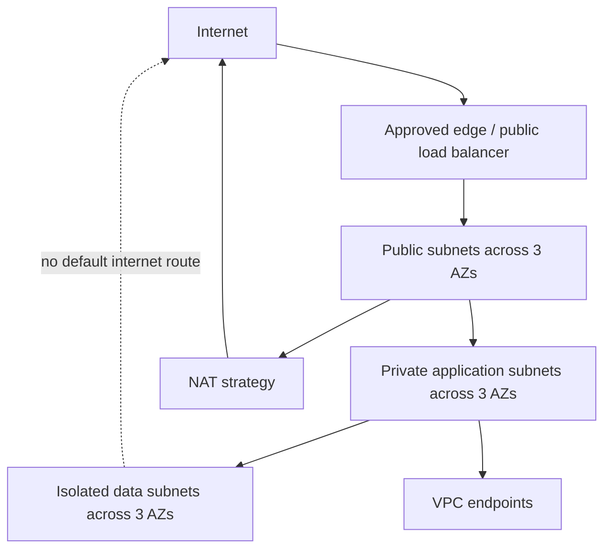
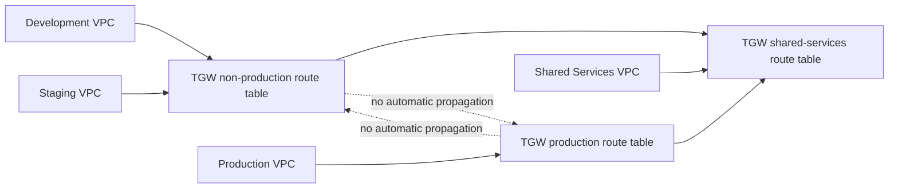

# Multi-Account Networking Standard

## Status and scope

**Status:** initial design; CIDRs and shared-network services are provisional.

This standard defines the intended network shape before Terraform implementation. The CIDRs originate as examples in [decisions-and-prerequisites.md](decisions-and-prerequisites.md) and are not approved until checked against enterprise IPAM, on-premises, partner, VPN, Direct Connect, and acquired-network ranges.

## Principles

- No overlapping CIDRs across landing-zone VPCs or connected networks.
- Workloads run in private subnets by default; databases and sensitive data services use isolated subnets.
- Public subnets contain only approved edge/load-balancing and NAT resources, not general application instances.
- Production has no implicit route or security trust to development or staging.
- Network reachability requires routes, security controls, and an approved business flow; account membership alone grants none.
- Flow Logs are mandatory for workload VPCs and delivered to an approved central destination.
- Prefer VPC endpoints when they improve security or reduce NAT processing cost without creating excessive endpoint cost.
- Multi-AZ resilience is required for production; lower-cost non-production choices must be explicit.

## Provisional CIDR allocation

| Account/environment | Provisional VPC CIDR | Address range | Internal overlap result | Approval status |
|---|---|---|---|---|
| Development | `10.10.0.0/16` | `10.10.0.0`–`10.10.255.255` | None | REQUIRED IPAM validation |
| Staging | `10.20.0.0/16` | `10.20.0.0`–`10.20.255.255` | None | REQUIRED IPAM validation |
| Production | `10.30.0.0/16` | `10.30.0.0`–`10.30.255.255` | None | REQUIRED IPAM validation |
| Shared Services | `10.40.0.0/16` | `10.40.0.0`–`10.40.255.255` | None | REQUIRED IPAM validation |
| Security | `10.50.0.0/16` | `10.50.0.0`–`10.50.255.255` | None | VPC need and IPAM approval unresolved |
| Logging | `10.60.0.0/16` | `10.60.0.0`–`10.60.255.255` | None | VPC need and IPAM approval unresolved |

### Overlap analysis

The six proposed `/16` ranges do not overlap one another because each has a distinct second octet and spans only that second-octet block. This proves internal separation only. It does **not** prove suitability for enterprise use because all ranges are within RFC1918 `10.0.0.0/8`, which commonly overlaps existing networks.

Before approval, `<OWNER:ipam>` must compare every proposed range with:

- Existing AWS VPCs and VPC IPAM pools.
- On-premises networks reachable through VPN or Direct Connect.
- Partner/vendor/customer networks.
- Kubernetes pod/service and container bridge ranges.
- SD-WAN, inspection, proxy, and appliance networks.
- Planned mergers, acquisitions, or future Regions.

Any conflict must be resolved before VPC creation; NAT as an overlap workaround is not the default architecture.

## Standard VPC layout

The following subnet positions are provisional and repeat for each approved `/16`, where `<N>` is `10`, `20`, `30`, `40`, `50`, or `60`:

| Tier | AZ A | AZ B | AZ C | Purpose |
|---|---|---|---|---|
| Public | `10.<N>.0.0/24` | `10.<N>.1.0/24` | `10.<N>.2.0/24` | Approved load balancers, NAT Gateways, and edge resources only |
| Private application | `10.<N>.10.0/24` | `10.<N>.11.0/24` | `10.<N>.12.0/24` | Application compute and internal services |
| Isolated data | `10.<N>.20.0/24` | `10.<N>.21.0/24` | `10.<N>.22.0/24` | Databases and services without an internet default route |

This consumes nine `/24` subnets and preserves the rest of each `/16` for explicitly planned expansion. Availability-zone names are resolved dynamically per account; numeric AZ names do not guarantee the same physical zone across accounts. If physical AZ alignment is required, use AZ IDs after validating account mappings.

## Routing standard

### Public tier

- Default IPv4 route to an Internet Gateway only where internet-facing resources are approved.
- Public IP assignment disabled by default; explicitly enabled only for approved resource types.
- NAT Gateways, if selected, reside in public subnets with one Elastic IP each.

### Private application tier

- No route directly to an Internet Gateway.
- Optional default route to a same-AZ NAT Gateway, single non-production NAT Gateway, or centralized egress attachment according to `<NAT_MODE:environment>`.
- AWS service traffic should use approved gateway/interface endpoints where practical.

### Isolated data tier

- No internet default route and no NAT route.
- Routes limited to approved application tiers, endpoints, backup/management services, and explicit shared-network destinations.
- Database access is controlled by security groups referencing approved application security groups where supported.

## NAT and egress decision

| Model | Availability | Cost | Blast radius | Intended use |
|---|---|---|---|---|
| No NAT | Depends on endpoints/private services | Lowest NAT cost; endpoint costs may apply | Small | Isolated or endpoint-only workloads |
| Single NAT Gateway | AZ dependency for other AZs; cross-AZ path risk | Lower hourly count, possible cross-AZ processing | Medium | Cost-conscious development only after acceptance |
| NAT Gateway per AZ | Avoids cross-AZ NAT dependency | Highest gateway-hour count | Per AZ | Production default candidate |
| Centralized egress | Depends on TGW/inspection/egress VPC | TGW, appliance, NAT, and processing charges | Large shared domain | Compliance-driven centralized inspection only |

`<NAT_MODE:development>`, `<NAT_MODE:staging>`, and `<NAT_MODE:production>` are REQUIRED decisions. No Terraform default may silently create billable NAT Gateways.

## Shared connectivity and Transit Gateway

Transit Gateway is optional and remains `<DECISION:transit_gateway>`. If approved, it is owned by Shared Services `<ACCOUNT_ID:shared_services>` and shared using the approved organization/RAM model.

Requirements if adopted:

- Separate production, non-production, and shared-services TGW route tables.
- Explicit association and propagation; no full-mesh default.
- No direct production-to-non-production routes without a documented flow and approval.
- Attachment acceptance, ownership, rollback, and route validation recorded per account.
- Inspection and centralized egress routes fail closed or open only according to an approved availability/security decision.

VPC peering may be used only for a small, stable point-to-point requirement; it is not the default scalable topology.

## DNS standard

- Route 53 private hosted zones are owned in `<ACCOUNT_ID:shared_services>` only if centralized DNS is approved.
- Cross-account VPC associations use an approved authorization/association workflow and least-privilege roles.
- Split-horizon namespaces, resolver endpoints/rules, conditional forwarding, and on-premises DNS integration remain `<DECISION:dns_architecture>`.
- Production and non-production records/zones are separate where name collision or trust could create risk.
- Public-zone changes require ownership verification, DNSSEC decision, and independent production approval.

## VPC endpoints

- Evaluate S3 and DynamoDB gateway endpoints first.
- Evaluate interface endpoints for SSM, EC2 messages, SSM messages, KMS, Secrets Manager, ECR, STS, CloudWatch Logs, and other actual workload dependencies.
- Endpoint policies must be least privilege; an endpoint is not a substitute for IAM authorization.
- Interface endpoint hourly and data-processing cost must be compared with NAT and central-endpoint alternatives.
- Centralized endpoints require DNS and routing designs that do not couple production availability to non-production.

## Security groups and NACLs

- Security groups are the primary stateful workload control. No unrestricted `0.0.0.0/0` ingress except an explicitly approved listener on an edge resource.
- Prefer security-group references over CIDRs within a VPC where supported.
- Administrative access uses SSM or another approved brokered method; direct internet SSH/RDP is prohibited by default.
- Default security groups permit no ingress or egress after baseline management where technically feasible.
- NACLs remain simple and stateless; use them for explicit subnet-boundary requirements, not as a duplicate of every security-group rule.
- Rules require owner, purpose, protocol/port, source/destination, expiry for temporary access, and review evidence.

## Flow Logs and network evidence

All workload VPCs enable Flow Logs with:

- Destination `<LOG_DESTINATION:vpc_flow_logs>` and owning account `<ACCOUNT_ID:log_archive>` or another approved central pattern.
- Traffic selection `<FLOW_LOG_FILTER:accepted_rejected_or_all>`.
- Retention `<RETENTION:vpc_flow_logs>` and encryption `<KMS_KEY:vpc_flow_logs>`.
- Delivery-failure alarms and query access for Security/Audit.
- Workload administrators allowed to view their operational logs only through an approved access model; they cannot alter central retention.

Required evidence includes VPCs, subnets, route tables, endpoints, TGW attachments/routes if used, Flow Log status, and explicit production/non-production isolation tests.

## Failure domains and recovery

| Failure/change | Expected containment | Recovery design |
|---|---|---|
| Single AZ | Multi-AZ production tiers remain available | Same-AZ NAT and application/data redundancy; validate service-specific behavior |
| NAT Gateway/AZ route | Only dependent private subnets affected | Replace/re-route under runbook; avoid cross-AZ surprise paths |
| TGW route error | Potential multi-account impact | Staged route changes, saved before/after matrices, narrow propagation, rollback plan |
| Central inspection/egress failure | All attached egress may fail | Approved HA design and explicit fail-open/fail-closed policy |
| DNS resolver/zone error | Name resolution can fail across accounts | Separate prod/non-prod rules, change validation, rollback, query logging |
| Flow Log delivery failure | Workloads run but visibility degrades | Alarm, preserve local/service evidence, restore destination policy/KMS access |
| CIDR overlap discovered late | Routing ambiguity or failed attachment | Prevent through IPAM approval; renumbering is the preferred durable fix |

## Cost trade-offs

- NAT Gateway count and processed bytes can dominate small-environment network cost.
- Cross-AZ NAT, TGW, inspection, endpoint, and inter-Region traffic may stack processing/transfer charges.
- Interface endpoints trade NAT exposure/processing for per-AZ endpoint-hour and data charges.
- Centralized network services reduce duplication but increase shared failure domains and operational complexity.
- Flow Log volume, destination ingestion, storage, retention, and queries are billable.
- Three-AZ production improves resilience; non-production may use fewer billable components only through explicit decisions, while retaining CIDR/subnet consistency.

## Assumptions and unresolved decisions

- REQUIRED: IPAM and connected-network overlap validation for every proposed `/16`.
- REQUIRED: actual Regions and AZ count; home/governed Region approval does not itself select workload deployment Regions.
- REQUIRED: NAT mode per environment, IPv6 strategy, egress inspection, ingress architecture, and internet-facing workload policy.
- REQUIRED: TGW, centralized egress, VPC peering, Direct Connect/VPN, shared endpoints, and DNS architecture decisions.
- REQUIRED: Flow Log destination, format/filter, encryption, retention, query tooling, and access model.
- REQUIRED: security/NACL standards for application-specific ports and administrative access.
- Assumption: production uses three AZs where supported and has no automatic route to non-production.
- Assumption: Security and Logging VPCs are created only if those accounts have an actual network workload.
