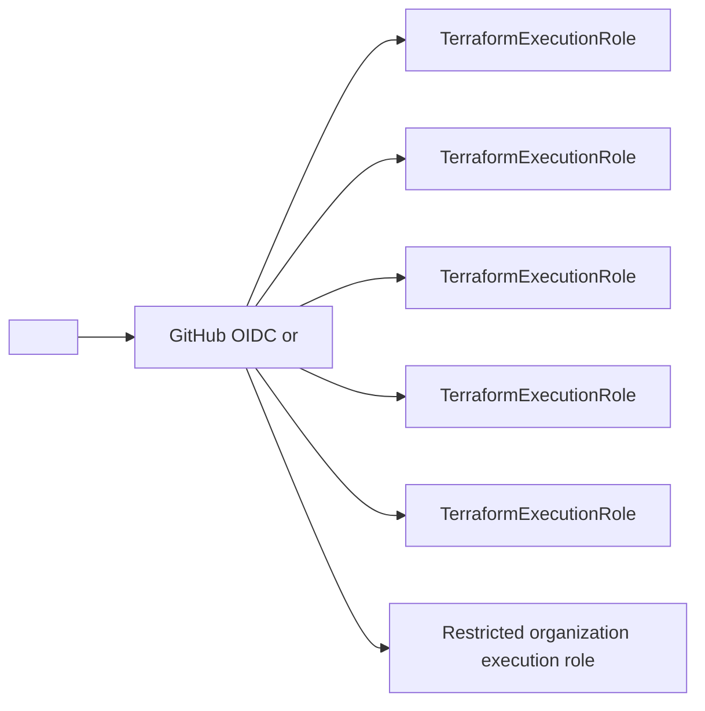
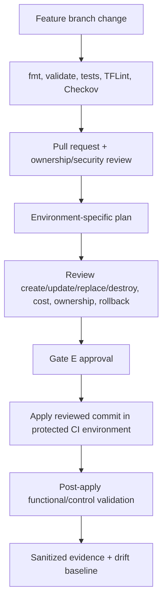

# Terraform Delivery and State Workflow

## Status and principles

**Status:** initial design; no deployable Terraform roots exist yet.

Terraform extends the Control Tower landing zone; it does not own the landing-zone baseline. The canonical tool constraints are [versions.md](versions.md) and `infra/templates/versions.tf`.

Principles:

- One clear resource owner and one state owner per resource.
- Separate state per control-plane domain and workload environment.
- Temporary credentials only; no committed credentials or human access keys.
- Plans are reviewed artifacts; applies use the same reviewed configuration and protected environment.
- Code is promoted; state is never copied between development, staging, and production.
- Production apply is CI-only except a documented, approved emergency procedure.

## Resource ownership gate

Before adding a Terraform resource, answer:

1. Does Control Tower, Account Factory, a managed StackSet, or another platform already own it?
2. Which account and Region contain it?
3. Which module and state will own its full lifecycle?
4. Which execution role can change it?
5. What is the cost and failure domain?
6. How is it imported, recovered, replaced, and validated?

If ownership is ambiguous, implementation stops. Control Tower resources are not imported merely to make Terraform authoritative.

## Repository layout and deployable-root rule

```text
infra/
├── modules/                 reusable modules; no backend blocks
├── environments/
│   ├── bootstrap/           state backend bootstrap
│   ├── organization/        custom SCPs and approved organization extensions
│   ├── control-tower/       data/documentation integration only unless ownership is approved
│   ├── aft/                 deferred
│   ├── security/
│   ├── logging/
│   ├── shared-services/
│   ├── development/
│   ├── staging/
│   └── production/
├── policies/
└── templates/versions.tf
```

An environment directory becomes deployable only when it contains real configuration, the canonical version constraints, approved backend configuration, variables/validation, outputs, documentation, tests, account/role identifiers supplied outside Git, and ownership approval. README-only directories must reject `make init` and `make plan`.

## Version strategy

- Terraform CLI is pinned to `1.11.1` in `.terraform-version`.
- AWS provider is pinned to `6.51.0` in the canonical template.
- Every implemented root/module copies the required-version/provider constraint.
- Every deployable root commits its generated `.terraform.lock.hcl`.
- Upgrades change the CLI constraint, provider constraint, lock files, CI version, tests, and plans in one reviewed promotion.

## State topology

The backend bucket, account, Region, and KMS key are unresolved typed values:

- State account: `<ACCOUNT_ID:terraform_state>`
- Bucket: `<S3_BUCKET:terraform_state>`
- Region: `<REGION:terraform_state>`
- KMS key: `<KMS_KEY:terraform_state>`
- CI role: `<ROLE_ARN:terraform_execution_environment>`

Proposed state keys:

| Terraform root | State key | Primary target account | Notes |
|---|---|---|---|
| Bootstrap | `bootstrap/terraform.tfstate` after migration | `<ACCOUNT_ID:terraform_state>` | Starts with tightly controlled local state, then migrates to remote backend |
| Organization | `organization/terraform.tfstate` | `<ACCOUNT_ID:management>` | Custom SCPs/extensions only; no Control Tower baseline ownership |
| Control Tower integration | `control-tower/terraform.tfstate` | `<ACCOUNT_ID:management>` | Prefer data sources/documentation; omit state if no managed extensions exist |
| Security | `security/terraform.tfstate` | `<ACCOUNT_ID:security>` plus approved org calls | Delegated-admin extensions and alerts |
| Logging | `logging/terraform.tfstate` | `<ACCOUNT_ID:log_archive>` | Only non-Control-Tower-owned extensions |
| Shared Services | `shared-services/terraform.tfstate` | `<ACCOUNT_ID:shared_services>` | Network hub/DNS/shared tooling if approved |
| Development | `development/terraform.tfstate` | `<ACCOUNT_ID:development>` | Development workload foundation |
| Staging | `staging/terraform.tfstate` | `<ACCOUNT_ID:staging>` | Staging workload foundation |
| Production | `production/terraform.tfstate` | `<ACCOUNT_ID:production>` | Protected production foundation |
| AFT | `aft/terraform.tfstate` | `<ACCOUNT_ID:aft>` | Not created while AFT is deferred |

Further split a root when resources have different owners, credentials, failure domains, deployment cadence, or blast radius. Do not combine all accounts into one state for convenience.

## Backend and locking model

The approved design candidate is:

- S3 bucket with versioning, Block Public Access, TLS-only policy, encryption using `<KMS_KEY:terraform_state>`, access logging/CloudTrail as approved, and recovery ownership.
- S3 lockfile with `use_lockfile = true`; do not introduce deprecated DynamoDB locking for a new build.
- Least-privilege access to each state prefix and its lock file.
- No backend credentials in HCL, environment files, or CI secrets.
- Object Lock only after legal/retention and operational recovery review.

Bootstrap is a dependency exception: create the backend with an approved identity and local state, immediately protect and migrate that state, then disable routine local mutation. Backup copies are sensitive and must not be committed.

## Provider and role-assumption model

Each root uses one default provider for its primary account. Provider aliases are used only for a resource that genuinely spans accounts or Regions and cannot be safely split.



Direct OIDC trust per target environment is the proposed model because it avoids long-lived keys and unnecessary role chaining. Trust conditions must restrict repository, branch/tag, GitHub environment, and audience. The management account receives a distinct, narrower organization role. Logging and security roles cannot grant application administration by default.

Example placeholder shape—not a deployable ARN:

```hcl
provider "aws" {
  region = var.aws_region

  assume_role {
    role_arn = var.terraform_execution_role_arn
  }

  default_tags {
    tags = local.required_tags
  }
}
```

Account IDs, role ARNs, bucket names, and emails are supplied through approved CI/environment configuration or an access-controlled parameter source, never committed values.

## Module standard

Each module includes:

- `versions.tf`, `main.tf`, `variables.tf`, `outputs.tf`, and README when implementation begins.
- Typed variables with validation and no environment-specific account IDs.
- Required tags: `Project`, `Environment`, `Owner`, `ManagedBy`, and `CostCenter` after values are approved.
- No provider blocks unless the module has a documented exceptional reason; providers are passed from roots.
- No backend blocks in modules.
- Minimal outputs that avoid secrets.
- Native Terraform tests or equivalent fixtures for critical logic.
- Ownership, failure/recovery, cost, Control Tower overlap, and examples.

Modules must not create resources just to make a plan non-empty.

## Plan and apply workflow



Plan and apply controls:

- Pull requests never apply.
- A saved binary plan is short-lived, access-controlled, and treated as sensitive; it is not committed.
- Apply must use the reviewed commit and approved target environment. If a plan is regenerated, review it again.
- Any destroy or replacement receives explicit approval beyond a general apply approval.
- State locking and CI concurrency prevent overlapping runs per state.
- Production uses protected branch/environment approvals and a production-specific role.
- Post-apply validation failure opens remediation/rollback; apply success alone is not completion.

## Development-to-production promotion

| Stage | Entry criteria | Required validation | Exit evidence |
|---|---|---|---|
| Development | Static checks and development plan reviewed | Module behavior, expected control results, cost sanity, no unintended resources | Development apply and validation evidence |
| Staging | Same reviewed module version passed development | Production-like integrations, security checks, routing, recovery/rollback rehearsal | Staging evidence and production plan candidate |
| Production | Staging evidence accepted and production plan explicitly approved | Protected apply, health checks, central logging/security delivery, no-drift follow-up | Production change/evidence record |

Environment variables, data, credentials, backends, and state remain separate. Promotion does not imply identical capacity or NAT topology, but deviations are documented.

## CI/CD separation

Separate workflows or clearly separated jobs are required for:

- Validation and security scanning.
- Organization/control policy changes.
- Security and logging extensions.
- Shared network changes.
- Each workload environment.
- AFT account requests if AFT is later adopted.

Organization, policy, logging, security, and shared-network plans require specialist review because their blast radius spans accounts. A workflow must never infer permission to apply merely from a successful plan.

## Drift, import, and manual changes

- Schedule `terraform plan -detailed-exitcode` per implemented root.
- Exit `0` means no drift, `2` means changes/drift requiring review, and `1` means an error.
- Import only Terraform-owned existing resources after documenting provenance, configuration, and lifecycle.
- Never import Control Tower baseline resources to silence drift.
- Emergency manual changes require a case/change record and prompt reconciliation into code or explicit rollback.
- Use `moved`/`import` blocks and state operations only under reviewed recovery/migration procedures; back up state first.

## Failure and recovery

| Failure | Response |
|---|---|
| State lock remains after failed run | Confirm no active writer, preserve logs, and use controlled force-unlock only with the exact lock owner/state evidence |
| State object deleted/corrupted | Stop applies, preserve current infrastructure, recover a verified S3 version, validate lineage/serial, and run a refresh-only/normal plan as appropriate |
| KMS access lost | Restore approved key policy/grants through the recovery owner; do not replace state blindly |
| Partial apply | Preserve state and logs, inspect actual resources, correct code/configuration, and plan; do not rerun repeatedly without analysis |
| Provider upgrade regression | Revert reviewed constraints/lock file and code or remediate in development first; never downgrade state casually |
| CI unavailable | Pause changes; use emergency local production apply only through an explicit incident/change procedure |
| Wrong-account plan | Stop immediately; provider/account assertions and `aws_caller_identity` preconditions must prevent apply |

Each root documents RTO/RPO for its state and the exact recovery owner `<OWNER:state_root>`.

## Cost and security trade-offs

- More state splits improve blast-radius and access separation but increase pipeline/configuration overhead.
- Direct per-account OIDC roles improve isolation but require multiple reviewed trust policies.
- Provider aliases can reduce pipeline count but enlarge one state's credentials and failure domain; prefer separate roots.
- State versioning and KMS add small recurring cost but are mandatory recovery/security controls.
- Security scanning adds pipeline time; exceptions require expiry and owner rather than disabling the gate.
- Plans and state contain sensitive metadata even when outputs are not marked secret; restrict artifacts and logs accordingly.

## Assumptions and unresolved decisions

- REQUIRED: state account, bucket, Region, KMS key, prefix policies, retention, recovery owners, and bootstrap identity.
- REQUIRED: CI platform/repository, OIDC subject conditions, protected branches/environments, approvers, and artifact retention.
- REQUIRED: exact execution role permissions and whether direct OIDC per account is approved.
- REQUIRED: environment variable source, cost-center values, state RTO/RPO, and emergency apply process.
- REQUIRED: TFLint, Checkov, and pre-commit installation before their gates can run locally.
- Assumption: Terraform `1.11.1`, AWS provider `6.51.0`, S3 lockfiles, and committed lock files remain the initial version standard.
- Assumption: AFT state/root remains unused while AFT is deferred.
